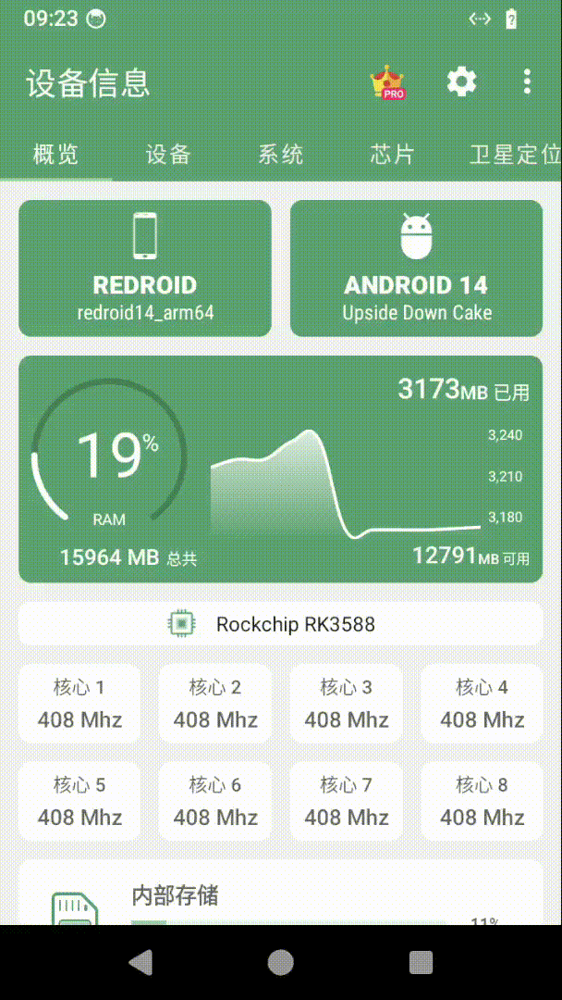

# For rk3588 docker android gpu & vpu 硬编解码
## 效果展示
2025-3-26: 升级适配6.1.84内核




## 创建项目&拉取代码

```bash
# 创建目录
mkdir ~/aniyo && cd ~/aniyo
# 拉取aosp代码
repo init -u https://android.googlesource.com/platform/manifest --git-lfs --depth=1 -b android-15.0.0_r1
# 可选用国内镜像
# repo init -u https://mirrors.tuna.tsinghua.edu.cn/git/AOSP/platform/manifest --git-lfs --depth=1 -b android-15.0.0_r1
# 生成local_manifests文件夹并下载脚本
git clone https://github.com/playzyx/aniyo-android.git ~/aniyo/.repo/local_manifests -b android-15
# 执行脚本生成xml
./.repo/local_manifests/generate_remove_projects.sh ~/aniyo/.repo/manifests/default.xml ~/aniyo/.repo/local_manifests/aniyo.xml
# 同步源码
repo sync -c --no-repo-verify -j24
```
